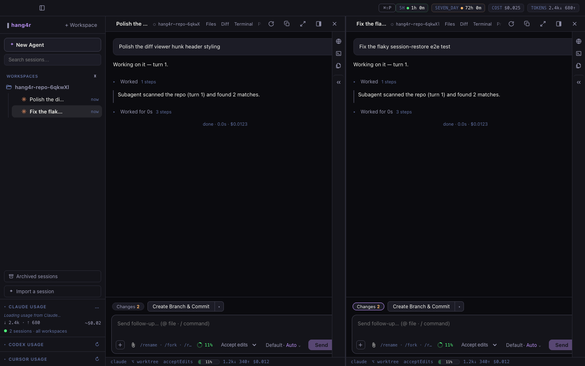

# hang4r

**A free macOS agents window that runs your Claude Code, Codex, and Cursor CLI
agents in parallel** — your own subscriptions, isolated git worktrees, real
diff review. No API keys, no markup, nothing to pay.

[Download for macOS](https://hang4r.dev) · [Blog](https://hang4r.dev/blog/) · MIT licensed



## What it does

- **Parallel sessions, one window.** Claude Code, Codex, and Cursor run side
  by side as tiled sessions — chat, Monaco editor, terminal, and diff review
  per tile.
- **Your subscriptions, not API keys.** hang4r spawns the CLIs you already
  have installed and logged in. It never calls model APIs, never touches your
  credentials, never writes to `~/.claude`. Hooks, skills, and MCP all work —
  because it literally runs *your* CLI.
- **Isolated git worktrees.** Each session gets its own worktree and branch,
  with a checkpoint commit after every agent turn. A bad turn is a rewind,
  not an archaeology dig.
- **Diff review that talks back.** Leave review comments on the changes —
  they become the agent's next prompt.
- **Agents with eyes.** Every agent gets a `hang4r browser` CLI to drive the
  built-in browser: click, read the DOM, check console errors, screenshot —
  so "I fixed the form" ships with evidence. See
  [docs/browser-cli.md](docs/browser-cli.md).
- **Honest by design.** When a backend can't do something (Cursor can't rewind
  history; headless Cursor can't answer permission prompts), the UI says so
  instead of faking it.

## Install

- Download the signed, notarized build from [hang4r.dev](https://hang4r.dev)
  or [GitHub Releases](https://github.com/Angel-Mu/hang4r-releases/releases).
- Requires the CLIs you want to use, installed and logged in: `claude`
  (Claude Code), `codex`, and/or `cursor-agent`.

## Development

Requires Node 22.22.2 (`.nvmrc`) and at least one agent CLI installed.

```bash
nvm use
npm install        # rebuilds better-sqlite3 + node-pty for Electron
npm run dev        # electron-vite with HMR
npm run verify     # build + full e2e suite (fake agent — no tokens spent)
```

Architecture notes live in [CLAUDE.md](CLAUDE.md) and `docs/`.

## Support

hang4r is free and stays free — it wraps subscriptions you already pay for,
so there's nothing to sell. If it saves you time:
[GitHub Sponsors](https://github.com/sponsors/Angel-Mu) ·
[Ko-fi](https://ko-fi.com/angel_xmu)

## Not affiliated

hang4r is an independent project, not affiliated with Anthropic, OpenAI, or
Cursor (Anysphere).
